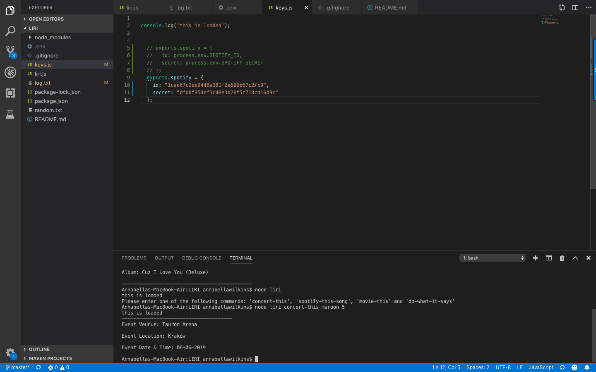
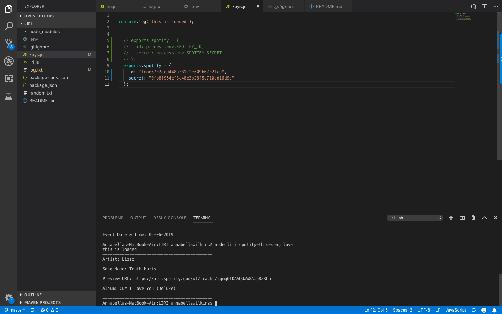
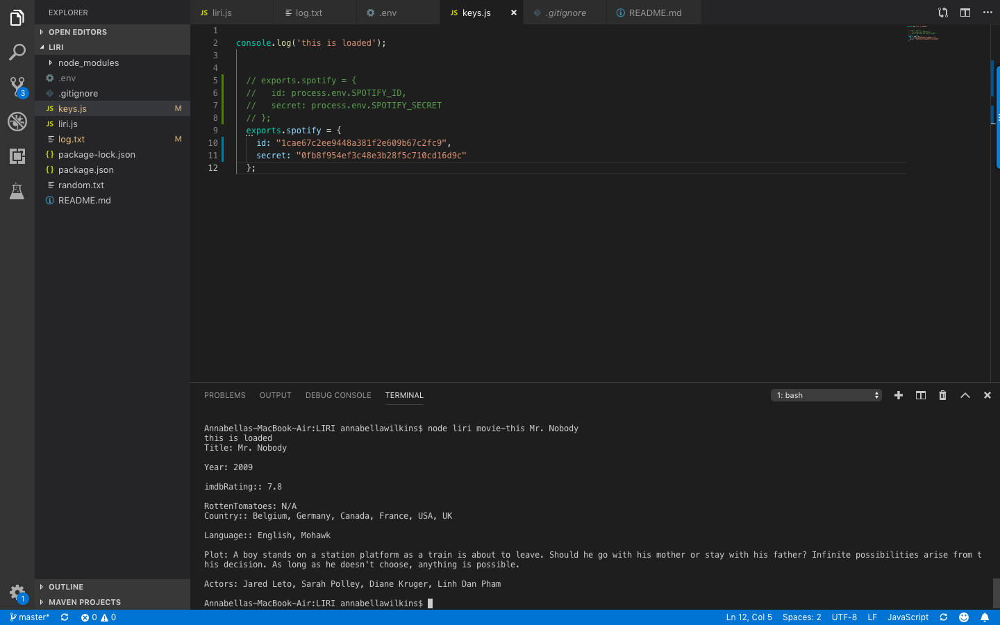
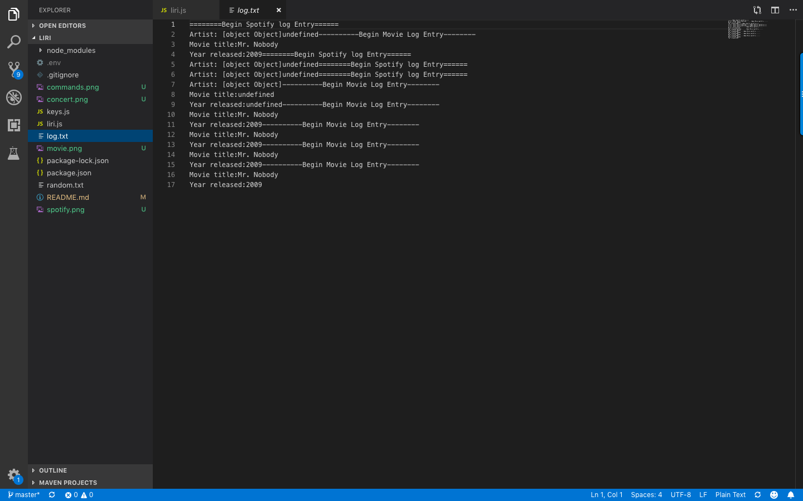

# Liri-Node-App
Creator: Annabella Wilkins

Created on: May 2019

Liri is a one-stop command line node app that takes in parameters for songs, bands, and movies and returns relevant data.

This app makes calls to the Spotify API, BandsInTown API, and OMDB API for serach results.

When running this app in your commend line, you might use the following to find your desire data:
'spotify-this-song', 'concert-this', 'movie-this' and 'do-what-it-says'.

Example 1: Run the concert-this command
 node liri.js concert-this <name of artist or band>
Output: The system will display a list of all events and locations where the artist or band will perform. 

Example 2: Run the spotify-this-song command

 node liri.js spotify-this-song <name of song>
Output: The system will display a list of information associated with the song. 

Example 3: Run the movie-this command

 node liri.js movie-this <name of movie>
Output: The system will display information associated with the movie. 

Example 4: Run the do-what-it-says command

 node liri.js do-what-it-says
Output: The system will read the text in the random.txt file, and perform the comman listed in the random.txt file.

See screen-shot below:

