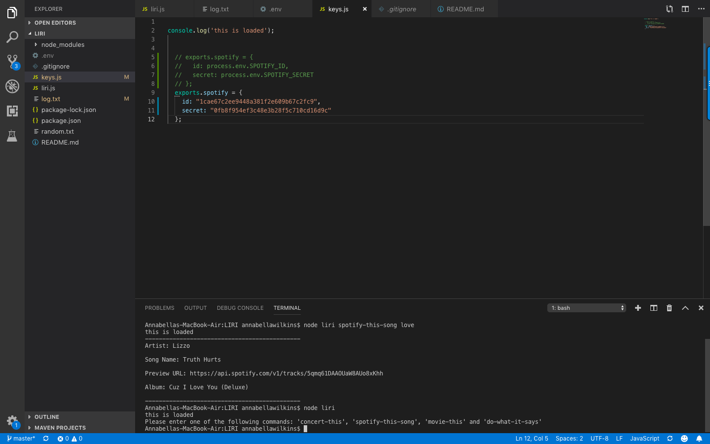

# Liri-Node-App
Creator: Annabella Wilkins

Created on: May 2019

Liri is a one-stop command line node app that takes in parameters for songs, bands, and movies and returns relevant data.

This app makes calls to the Spotify API, BandsInTown API, and OMDB API for serach results.

When running this app in your commend line, you might use the following to find your desire data:
'spotify-this-song', 'concert-this', 'movie-this' and 'do-what-it-says'.

Example 1: Run the concert-this command

 node liri.js concert-this <name of artist or band>
Output: The system will display a list of all events and locations where the artist or band will perform. It can result in multiple records. The system will also log all the results in the log.txt file. See screen-shot below: